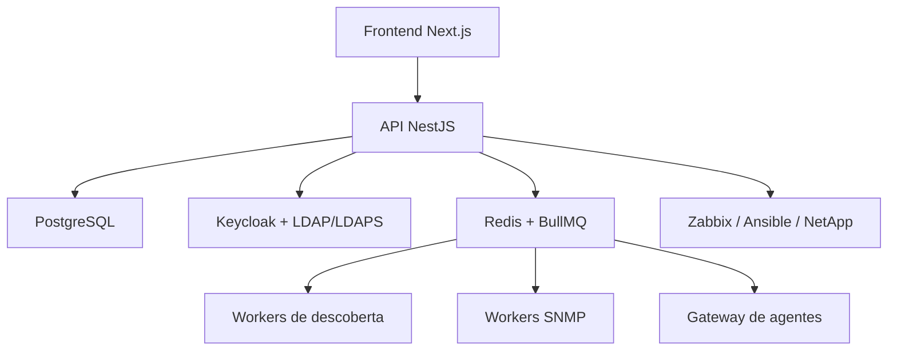

# Contexto do Projeto — Plataforma de Gestão de Infraestrutura e Ciberdefesa

## 1. Visão geral

O objetivo é desenvolver uma aplicação web moderna, modular e segura para centralizar a gestão da infraestrutura tecnológica do Centro. A plataforma deverá combinar funções de IPAM, inventário de equipamentos, gestão de VLANs e interfaces de rede, DCIM/bastidores, inventário de servidores, descoberta de hosts, integração com agentes, ligações para aplicações internas e visualização estatística.

A aplicação não deverá depender exclusivamente de network discovery. Deve permitir registo e gestão manual dos ativos, enriquecidos posteriormente por informação recolhida automaticamente através de SNMP, ICMP, TCP, APIs específicas e agentes instalados nos sistemas.

O princípio central da aplicação é permitir navegar pela relação:

```text
Bastidor → Equipamento → Interface → VLAN → Subnet → IP → Host/Serviço
```

Exemplo de utilização: o operador abre a imagem de um switch, seleciona a porta `Ethernet1/1`, consulta a configuração da interface, seleciona uma VLAN permitida e é encaminhado para a página dessa VLAN, onde pode consultar as subnets, IPs, hosts e equipamentos associados.

## 2. Objetivos funcionais

### 2.1 Gestão de IPs, subnets e VLANs

A aplicação deverá permitir:

- Criar, editar e remover sites, localizações, subnets e VLANs.
- Registar o gateway, finalidade, ambiente e localização de cada subnet.
- Gerir IPs livres, ocupados, reservados, excluídos e desconhecidos.
- Associar IPs a hostnames, MAC addresses, equipamentos, interfaces e serviços.
- Identificar a origem de cada informação: manual, SNMP, agente, ICMP, TCP, DNS, DHCP ou importação.
- Consultar todos os hosts existentes numa VLAN, por IP ou por nome.
- Associar uma VLAN a uma ou mais subnets quando o desenho da infraestrutura o exigir.
- Registar VLAN ID, nome, descrição, localização e equipamentos onde está configurada.

Cada IP deverá guardar, pelo menos:

- Endereço IP e versão IPv4/IPv6.
- Subnet.
- Estado.
- Hostname.
- MAC address.
- Equipamento/interface associados.
- Sistema operativo, quando conhecido.
- Última deteção.
- Método de deteção.
- Observações.

### 2.2 Gestão de switches e portas

Os switches deverão ser apresentados através de modelos visuais configuráveis. Cada modelo deverá definir fabricante, modelo, número e disposição das portas, tipos de interface, imagem frontal e coordenadas das portas na imagem.

Ao selecionar uma porta, a interface deverá apresentar:

- Nome da interface.
- Descrição.
- Estado administrativo e operacional.
- Velocidade e duplex.
- Tipo de porta: access, trunk ou outro.
- VLAN access.
- VLAN nativa.
- VLANs permitidas.
- MAC addresses aprendidos.
- Hosts e equipamentos associados.
- Estatísticas de tráfego.
- Última sincronização.
- Última alteração conhecida.

Exemplo:

```text
Interface: Ethernet1/1
Estado: Up
Tipo: Trunk
VLAN nativa: 10
VLANs permitidas: 10, 12, 20
Velocidade: 10 Gbps
Descrição: Uplink para outro switch
```

SNMP standard poderá fornecer estado, velocidade, uptime, interfaces, tráfego, modelo e informação geral. A configuração completa de uma porta poderá exigir MIBs específicas do fabricante, API REST, NETCONF/RESTCONF, SSH controlado ou importação de configuração. Esta limitação deve ser refletida na arquitetura desde o início.

### 2.3 Gestão de bastidores e ativos físicos

A aplicação deverá representar a hierarquia física:

```text
Site → Edifício → Sala → Bastidor → Unidade U → Equipamento
```

Deverá permitir visualizar a frente e, posteriormente, a traseira do bastidor, com equipamentos posicionados por unidades U. Cada ativo físico poderá conter:

- Tipo: servidor, switch, router, firewall, storage, NetApp, UPS, patch panel, etc.
- Fabricante e modelo.
- Número de série.
- Asset tag.
- Estado.
- Localização e posição no bastidor.
- Firmware.
- Data de aquisição e garantia.
- Responsável.
- Licenciamento.
- Notas.
- Ligações físicas e lógicas.

### 2.4 Servidores, virtualização e agentes

SNMP será usado para informação geral, mas a informação detalhada de servidores deverá ser obtida através de agentes.

O agente deverá poder recolher:

- Sistema operativo e versão.
- Hostname e uptime.
- CPU, memória e discos.
- Interfaces de rede.
- Serviços em execução.
- Processos relevantes.
- Patches instalados.
- Software instalado.
- Número de série.
- Plataforma de virtualização.
- Máquinas virtuais.
- Certificados e respetivas datas de expiração.
- Estado e versão do próprio agente.

Devem existir, inicialmente, agentes para Windows Server e Linux. A comunicação deverá ser iniciada pelo agente para o servidor central, usando TLS e permissões mínimas. O agente não deverá permitir execução arbitrária de comandos por defeito.

### 2.5 NetApp e armazenamento

Para NetApp deverá ser privilegiada a API oficial de gestão. SNMP poderá complementar métricas gerais, mas não deverá ser a única fonte para informação detalhada.

Deverá ser possível consultar clusters, controllers, aggregates, volumes, LUNs, espaço total e disponível, snapshots, deduplicação, thin provisioning, estado dos discos, número de série, firmware, licenciamento, alertas e relações de replicação.

### 2.6 Descoberta de hosts

O módulo de descoberta deverá ser independente do inventário oficial e permitir trabalhos agendados ou manuais por subnet.

Métodos:

- ICMP para detetar hosts que respondem a ping.
- TCP para testar portas configuráveis.
- SNMP para identificar dispositivos de rede.
- DNS/reverse DNS para obter nomes.
- DHCP para consultar leases e reservas.
- APIs ou conectores específicos quando disponíveis.

As portas TCP deverão ser configuráveis por perfil. Exemplos: SSH, DNS, HTTP/HTTPS, RPC, SMB, RDP, SNMP, WinRM e portas de aplicações internas.

Uma descoberta deverá produzir um resultado pendente, não criar automaticamente um ativo definitivo. O operador deverá poder rever, associar, converter, ignorar ou marcar o resultado como falso positivo.

## 3. Integrações e portal interno

A plataforma deverá conter um portal de ligações para aplicações importantes do Centro, com visibilidade controlada por grupos LDAP. As ligações poderão incluir:

- BookStack para documentação.
- Zabbix para monitorização.
- Zammad para incidentes e pedidos.
- Rocket.Chat para comunicação operacional.
- Ansible para automação e orquestração.

Cada ligação deverá ter nome, URL, ícone, descrição, categoria, ordem, grupos autorizados e, opcionalmente, verificação de disponibilidade HTTP.

A nova aplicação deverá funcionar como mapa central da infraestrutura, sem substituir sistemas especializados:

| Sistema | Responsabilidade principal |
|---|---|
| Nova aplicação | Inventário, IPAM, VLANs, portas, bastidores e relações |
| Zabbix | Métricas, disponibilidade, histórico e alertas |
| Ansible | Configuração, recolha e automação |
| BookStack | Documentação detalhada |
| Zammad | Incidentes e pedidos |
| Rocket.Chat | Comunicação operacional |

## 4. Tecnologias open-source recomendadas

### 4.1 Frontend

- Next.js com TypeScript.
- React.
- Tailwind CSS.
- shadcn/ui para componentes acessíveis e consistentes.
- React Query/TanStack Query para cache e sincronização com a API.
- React Hook Form e Zod para formulários e validação.
- Apache ECharts ou Recharts para gráficos.
- SVG e componentes React para switches e bastidores interativos.

### 4.2 Backend

- Node.js com TypeScript.
- NestJS para uma arquitetura modular, ou Fastify com uma organização própria mais leve.
- Recomenda-se NestJS se o projeto crescer para vários módulos, workers e integrações.
- REST API versionada; GraphQL poderá ser considerado mais tarde para consultas complexas.
- OpenAPI/Swagger para documentação da API.
- Pino para logging estruturado.

### 4.3 Base de dados e processamento assíncrono

- PostgreSQL como base de dados principal.
- PostGIS apenas se forem necessárias representações geográficas mais avançadas.
- Redis para filas, locks, cache e estado de trabalhos.
- BullMQ para trabalhos de descoberta e sincronizações periódicas.
- Prisma ou Drizzle ORM; Prisma é recomendado para acelerar o desenvolvimento inicial.

PostgreSQL é preferível a uma base documental porque o domínio tem relações fortes entre equipamentos, interfaces, VLANs, subnets, IPs, bastidores, hosts e serviços.

### 4.4 Autenticação e autorização

Todos os componentes de autenticação deverão ser open-source. A aplicação deverá suportar LDAP sobre TLS (LDAPS) e, quando necessário, LDAP com StartTLS.

Opções recomendadas:

- Keycloak como Identity and Access Management open-source.
- Keycloak federado com Active Directory ou outro servidor LDAP.
- Ligação do Keycloak ao LDAP através de LDAPS.
- OpenID Connect entre o frontend/backend e o Keycloak.
- Mapeamento de grupos LDAP para roles da aplicação.

Esta abordagem evita implementar diretamente no frontend a gestão de passwords e permite futuramente integrar MFA, SSO, certificados e outros identity providers.

O backend deverá validar tokens OIDC, aplicar RBAC e registar auditoria. Roles iniciais:

- Administrador.
- Operador de rede.
- Operador de sistemas.
- Operador de armazenamento.
- Auditor.
- Apenas leitura.

Deverão ser controladas permissões como ver inventário, editar IPs, editar VLANs, executar descobertas, gerir credenciais, alterar dados sensíveis e administrar integrações.

### 4.5 Recolha, agentes e protocolos

- SNMPv3 como opção preferencial.
- SNMPv2c apenas quando tecnicamente necessário e com secrets protegidos.
- ICMP e TCP através de workers controlados.
- NETCONF/RESTCONF, APIs REST e SSH apenas como conectores específicos.
- Agentes Windows e Linux com comunicação outbound sobre HTTPS/TLS.
- API NetApp para storage.
- APIs do Zabbix e Ansible para integrações futuras.

### 4.6 Execução e operação

- Docker ou Podman.
- Docker Compose/Podman Compose para desenvolvimento e primeiro deployment.
- Nginx ou Caddy como reverse proxy TLS.
- Prometheus e Grafana, se for necessário monitorizar a própria plataforma.
- MinIO, caso seja necessário guardar ficheiros, exports ou snapshots localmente.
- Git para controlo de versões.
- CI/CD com ferramentas open-source, como Gitea Actions, GitLab CI ou Jenkins, conforme a infraestrutura disponível.

## 5. Arquitetura lógica



Os workers deverão estar separados do processo principal da API. Uma descoberta ou sincronização SNMP nunca deverá bloquear pedidos normais da interface web.

## 6. Modelo de dados inicial

Entidades principais:

- `users`, `roles`, `permissions`, `audit_logs`.
- `sites`, `buildings`, `rooms`, `racks`, `rack_units`.
- `device_models`, `devices`, `device_interfaces`, `device_connections`.
- `vlans`, `subnets`, `ip_addresses`, `mac_addresses`.
- `hosts`, `services`, `virtual_machines`.
- `storage_systems`, `storage_volumes`, `storage_licenses`.
- `agents`, `agent_versions`, `agent_reports`.
- `discovery_jobs`, `discovery_targets`, `discovery_results`.
- `credentials`, `integrations`, `application_links`.

As credenciais de SNMP, SSH, WinRM e APIs nunca deverão ser guardadas em texto simples. Devem ser encriptadas em repouso, protegidas por permissões de backend, auditadas e separadas entre credenciais de leitura e escrita.

## 7. Requisitos de segurança

- LDAPS obrigatório para ambientes de produção.
- Validação rigorosa do certificado do servidor LDAP.
- TLS para frontend, API, agentes e integrações.
- Segredos fora do código-fonte.
- Encriptação de credenciais na base de dados.
- RBAC baseado em grupos LDAP.
- Auditoria de login, alterações, descobertas, sincronizações e ações administrativas.
- Proteção contra CSRF, XSS, SQL injection e brute force.
- Rate limiting na API.
- Validação de todos os inputs com schemas.
- Isolamento dos workers de descoberta.
- Allowlist de destinos e portas quando possível.
- Sem execução arbitrária de comandos através da interface.
- Rotação e revogação de credenciais.
- Backups cifrados da base de dados.
- Separação de ambientes de desenvolvimento, testes e produção.

## 8. Linha cronológica de desenvolvimento

### Fase 0 — Decisões e preparação

1. Confirmar inventário inicial, sites, bastidores, equipamentos e subnets.
2. Definir nomes, estados e tipos oficiais dos ativos.
3. Definir grupos LDAP e roles da aplicação.
4. Definir requisitos de conectividade ao LDAP/LDAPS.
5. Escolher o repositório Git e o método de deployment.
6. Criar o `README`, regras de contribuição, ficheiro `.env.example` e documentação de arquitetura.

### Fase 1 — Esqueleto técnico

1. Criar monorepo ou estrutura organizada de frontend, backend e workers.
2. Configurar Next.js, TypeScript, Tailwind e shadcn/ui.
3. Configurar NestJS, PostgreSQL, Prisma e migrações.
4. Criar Docker Compose com frontend, API, PostgreSQL, Redis e Keycloak.
5. Criar health checks, logging e tratamento de erros.
6. Criar layout autenticado, navegação lateral, cabeçalho, breadcrumbs e tema visual.
7. Criar documentação OpenAPI.

Resultado: aplicação arranca localmente, tem layout moderno, base de dados, API e ambiente de autenticação preparado.

### Fase 2 — Autenticação e segurança base

1. Configurar Keycloak.
2. Configurar ligação do Keycloak ao LDAP através de LDAPS.
3. Validar certificados e cadeia de confiança.
4. Criar realm, client OIDC, grupos e roles.
5. Implementar login, logout, refresh e expiração de sessão.
6. Implementar guards no backend.
7. Criar auditoria e página de administração de permissões.

Resultado: apenas utilizadores LDAP autorizados acedem à aplicação.

### Fase 3 — Dashboard e portal interno

1. Criar dashboard com cards de resumo.
2. Criar gráficos mockados.
3. Criar página de links para BookStack, Zabbix, Zammad, Rocket.Chat e Ansible.
4. Aplicar visibilidade por grupo/role.
5. Criar estados de saúde das integrações.

Resultado: primeira versão navegável e útil mesmo sem discovery.

### Fase 4 — IPAM, subnets e VLANs

1. Implementar CRUD de sites, subnets, VLANs e IPs.
2. Implementar pesquisa, filtros e paginação.
3. Criar cálculo e validação de CIDR.
4. Mostrar utilização da subnet e IPs livres.
5. Associar IPs a hosts, interfaces, MACs e VLANs.
6. Registar fonte, confiança e data de atualização dos dados.
7. Criar importação CSV/JSON controlada.

Resultado: IPAM funcional e independente de descoberta automática.

### Fase 5 — Inventário de equipamentos e switches

1. Implementar tipos, fabricantes, modelos e equipamentos.
2. Criar templates visuais de switches.
3. Criar editor/configurador de portas.
4. Criar vista do switch com portas clicáveis.
5. Associar interfaces a VLANs, IPs, MACs e ligações.
6. Criar histórico de alterações manuais.

Resultado: navegação visual entre switch, porta, VLAN e hosts.

### Fase 6 — Bastidores e infraestrutura física

1. Implementar sites, edifícios, salas e bastidores.
2. Criar vista frontal do bastidor.
3. Posicionar equipamentos por unidade U.
4. Permitir arrastar e editar posições com validação de conflitos.
5. Criar ficha completa de ativo.
6. Adicionar ligações físicas e lógicas.

Resultado: inventário físico e lógico relacionado.

### Fase 7 — Descoberta ICMP e TCP

1. Criar perfis de descoberta por subnet.
2. Criar workers assíncronos.
3. Implementar ICMP.
4. Implementar TCP com portas configuráveis.
5. Integrar reverse DNS.
6. Criar página de progresso e resultados.
7. Permitir aprovar, associar, ignorar ou marcar resultados.
8. Guardar histórico de cada execução.

Resultado: identificação de hosts ativos sem obrigar a que todos sejam automaticamente inventariados.

### Fase 8 — SNMP e sincronização de rede

1. Implementar cofres de credenciais.
2. Suportar SNMPv3 e SNMPv2c quando necessário.
3. Criar perfis por fabricante/modelo.
4. Recolher sysName, sysDescr, uptime, interfaces, estado e tráfego.
5. Recolher MAC address tables e informação de VLAN quando suportado.
6. Criar sincronização manual e agendada.
7. Comparar estado descoberto com estado documentado.
8. Apresentar divergências para aprovação.

Resultado: inventário enriquecido e sincronizado com equipamentos reais.

### Fase 9 — Agentes Windows/Linux

1. Definir protocolo e formato de relatório.
2. Criar registo seguro de agentes.
3. Criar agente Windows.
4. Criar agente Linux.
5. Implementar TLS, heartbeat e atualização de versão.
6. Recolher OS, uptime, hardware, discos, serviços e software.
7. Adicionar virtualização e máquinas virtuais.
8. Criar estado de saúde dos agentes.

Resultado: inventário detalhado dos servidores.

### Fase 10 — NetApp e integrações avançadas

1. Integrar API NetApp.
2. Mostrar clusters, volumes, capacidade, snapshots e licenciamento.
3. Integrar API do Zabbix para links e estado.
4. Integrar Ansible para jobs controlados.
5. Associar incidentes do Zammad aos ativos.
6. Associar documentação BookStack aos equipamentos e serviços.

Resultado: plataforma central integrada com as ferramentas existentes.

### Fase 11 — Estatísticas, qualidade e produção

1. Criar gráficos históricos de utilização, disponibilidade e alterações.
2. Criar indicadores de qualidade do inventário.
3. Detetar IPs duplicados, ativos sem localização e dados desatualizados.
4. Criar exports CSV/JSON/PDF quando necessário.
5. Criar backups e testes de restauro.
6. Executar testes unitários, integração, segurança e carga.
7. Criar pipeline CI/CD.
8. Publicar deployment de produção com reverse proxy, TLS e monitorização.
9. Criar manual de operação e plano de recuperação.

## 9. MVP recomendado

O primeiro MVP deverá incluir:

- Login via Keycloak federado com LDAP/LDAPS.
- Dashboard.
- Gestão manual de equipamentos.
- Gestão de VLANs, subnets e IPs.
- Templates visuais de switches.
- Portas clicáveis.
- Associação porta → VLAN → hosts.
- Descoberta ICMP/TCP.
- Portal de links internos.
- Auditoria básica.

SNMP, bastidores avançados, agentes e NetApp deverão ser implementados depois de o modelo de dados e o fluxo manual estarem estáveis.

## 10. Critérios de conclusão da versão final

A aplicação será considerada funcional quando:

1. Um utilizador LDAP autorizado conseguir iniciar sessão através de LDAPS.
2. Um administrador conseguir criar sites, bastidores, equipamentos, VLANs, subnets e IPs.
3. Um operador conseguir abrir um switch, selecionar uma porta e consultar a configuração associada.
4. A seleção de uma VLAN mostrar os hosts, IPs, interfaces e equipamentos relacionados.
5. Uma subnet puder ser analisada por ICMP e TCP.
6. Os resultados de discovery puderem ser revistos antes de entrarem no inventário oficial.
7. Um equipamento puder ser localizado visualmente num bastidor.
8. Um servidor com agente puder apresentar sistema operativo, uptime, recursos, discos e VMs.
9. Uma NetApp puder apresentar capacidade, volumes, estado e licenciamento através da API apropriada.
10. As ações administrativas ficarem registadas em auditoria.
11. As aplicações internas puderem ser acedidas a partir do portal.
12. A plataforma puder ser instalada e atualizada de forma reprodutível através de containers e documentação técnica.

## 11. Princípios de desenvolvimento

- Desenvolver primeiro o modelo de dados e os contratos da API.
- Manter separadas a informação manual, descoberta e sincronizada.
- Nunca apagar silenciosamente informação obtida anteriormente.
- Guardar histórico de alterações importantes.
- Tornar todos os conectores opcionais e substituíveis.
- Usar jobs assíncronos para discovery e sincronização.
- Garantir funcionamento útil mesmo sem SNMP ou agentes.
- Privilegiar SNMPv3, LDAPS, TLS e princípio do menor privilégio.
- Manter a interface simples para operações frequentes e detalhada para investigação.
- Não transformar a aplicação num substituto integral de Zabbix, Ansible, BookStack ou Zammad.

## 12. Clarificação do objetivo operacional

O objetivo principal da aplicação é ser um mapa operacional moderno da infraestrutura do Centro, permitindo navegar pelas relações físicas e lógicas e não apenas consultar estatísticas.

Os fluxos prioritários são:

1. Abrir um modelo visual de switch, selecionar uma porta como `Ethernet1/1`, consultar a configuração da porta — por exemplo `access/trunk`, VLAN nativa, VLANs permitidas e estado — e navegar para as VLANs associadas.
2. A partir de uma VLAN, consultar os hosts dessa VLAN por endereço IP ou hostname, mantendo as relações entre VLAN, subnet, IP, host, interface e equipamento.
3. Representar sites, edifícios, salas e bastidores visualmente, posicionar servidores, switches, routers, firewalls, storage e NetApp e abrir a ficha técnica de cada ativo.
4. Enriquecer a ficha de servidores através de agentes Windows/Linux com sistema operativo, uptime, recursos, discos, serviços, software e máquinas virtuais.
5. Enriquecer storage NetApp através da API oficial com capacidade, volumes, estado, número de série, firmware, licenciamento e snapshots.
6. Usar SNMP/SNMPv3 e conectores específicos para enriquecer o inventário, sem substituir o registo manual inicial.
7. Permitir discovery ICMP/TCP por subnet como resultado pendente para revisão do operador, nunca como criação automática de ativos oficiais.

O dashboard deve ser um ponto de entrada operacional e apresentar dados reais do inventário e da auditoria. Não deve ser tratado como a funcionalidade central: os fluxos de navegação switch → porta → VLAN → subnet → IP → host e bastidor → equipamento → serviços têm prioridade sobre gráficos decorativos.

O portal de aplicações internas é um catálogo de atalhos para BookStack, Zabbix, Zammad, Rocket.Chat e Ansible. Cada ligação deve abrir num novo separador; a gestão dinâmica por administradores é opcional e não deve desviar o foco dos fluxos de infraestrutura.

## 13. Onboarding inicial multi-organização

Na primeira execução, a aplicação não deve assumir que existe um site ou uma organização pré-definida. Depois do login, um utilizador com a role `ADMIN` deve passar por um walkthrough inicial que:

1. Recolhe o nome, código e fuso horário da organização.
2. Cria pelo menos um site com código único.
3. Permite registar opcionalmente morada, cidade, região, país, edifício, sala e primeiro bastidor.
4. Só permite entrar no dashboard depois de existir organização e pelo menos um site.

O estado deste setup deve ser persistido em `SystemSettings`, auditado e reabrível por um administrador. Não devem ser criados equipamentos, VLANs, subnets ou outros dados fictícios durante o onboarding. A configuração física e o inventário detalhado serão preenchidos nos módulos seguintes.

## 14. Regras da Fase 4 — IPAM e discovery

O IPAM é a primeira funcionalidade operacional central. Os dados oficiais devem seguir a relação `Site → VLAN → Subnet → IP → Host`, permitindo mais tarde navegar da porta de um switch para a VLAN e respetivos hosts.

- Sites, VLANs, subnets e IPs podem ser registados manualmente.
- A primeira implementação valida CIDR IPv4 e limita VLAN IDs ao intervalo 1–4094.
- Discovery ICMP/TCP é sempre lançado contra uma subnet escolhida pelo operador.
- TCP usa portas configuráveis; reverse DNS é uma informação complementar.
- Cada execução fica registada como `DiscoveryJob` e cada host como `DiscoveryResult`.
- Resultados começam em `PENDING`; só `APPROVED` pode criar/atualizar um IP oficial.
- Resultados `IGNORED` permanecem no histórico e não alteram o inventário.
- A descoberta tem limite inicial de 4096 hosts por execução e é processada por workers BullMQ; retries, métricas e agendamento ficam para o próximo incremento.
- SNMP, interfaces de switch e agentes deverão enriquecer estas relações sem substituir o registo manual.

## 15. Estado atual e backlog imediato

### Implementado na Fase 4 inicial

- CRUD base de Sites, VLANs, Subnets e IPs.
- Validação e normalização de CIDR IPv4.
- Estados de IP e origem dos dados.
- `DiscoveryJob` e `DiscoveryResult` persistentes.
- Discovery ICMP/TCP limitado e configurável por subnet/portas.
- Discovery colocado numa fila BullMQ `discovery` sobre Redis 8, processado por worker separado.
- Reverse DNS best effort.
- Revisão manual com aprovação ou ignorar.
- Aprovação a criar/atualizar o IP oficial.
- Página IPAM em `/ipam`.
- IPAM com paginação, filtros por pesquisa/estado e ações de criação, edição e remoção de IPs.
- Entidades `Host` e `Service`; resultados aprovados promovem IP → Host e portas TCP abertas → Services.
- Sidebar fixo/sticky, recolhível por clique e expansível por hover, com estado persistente no browser.
- Sidebar partilhado nas áreas autenticadas e dropdown de utilizador com acesso a definições, ajuda e logout.
- Menus principais com rotas funcionais para infraestrutura, IPAM, descoberta, auditoria, definições e ajuda.
- Pesquisa do dashboard ligada a Sites, VLANs, Subnets e IPs reais.
- Endpoint e página de auditoria com eventos recentes.

### Atualização UX — workspace IPAM e shell global

- O IPAM usa agora uma workspace contextual com árvore navegável `Site → VLAN → Subnet`.
- A seleção é refletida por breadcrumbs, URL (`siteId`, `vlanId`, `subnetId`, `tab`) e tabs de Resumo, IPs, Hosts e serviços, Discovery e Detalhes.
- Criação e edição de Sites, VLANs e Subnets usam formulários modais; criação/edição de IPs usa o mesmo padrão.
- A tabela de IPs apresenta estado legível, hostname/host, MAC, VLAN, origem, serviços, pesquisa e paginação.
- Discovery tem área própria e distingue inventário oficial de resultados pendentes; resultados podem ser aprovados ou ignorados.
- O dashboard e as páginas internas usam exclusivamente `AppShell`.
- O sidebar é um rail fixo ao viewport, com largura aberta/recolhida persistida, expansão por hover e drawer mobile.
- O conteúdo operacional ocupa a largura disponível sem os limites artificiais anteriores.

### Atualização — menus funcionais e infraestrutura operacional

- O dashboard deixou de usar âncoras sem destino; ações rápidas apontam para Discovery, Infraestrutura, IPAM, Ajuda e Auditoria.
- `/descoberta` passou a ser uma consola operacional com execuções, resultados e revisão manual, mantendo o Discovery contextual no IPAM.
- `/infraestrutura` passou a listar, pesquisar, criar, editar e arquivar equipamentos e a consultar modelos.
- A API passou a expor equipamentos, modelos e interfaces; interfaces suportam VLAN nativa, VLAN de acesso e VLANs permitidas através de relação normalizada.
- `/definicoes` passou a consultar/editar organização para ADMIN, mostrar sessão/roles e estado das integrações.
- `/ajuda` passou a disponibilizar artigos internos para arranque, IPAM, Discovery, equipamentos, operação e troubleshooting.
- LDAP, SNMP, agentes, NetApp, bastidores visuais e diagrama frontal de switches continuam planeados.

### Próxima ordem de implementação

1. Filtros e paginação equivalentes para Sites, VLANs e Subnets, além da tabela de IPs.
2. Gestão visual de Hosts e Services no inventário.
3. Agendamento e histórico de execuções BullMQ, com retries e métricas do worker.
4. Suporte IPv6 e validações de sobreposição de subnets.
5. CRUD de equipamentos, modelos e interfaces.
6. Associação de interfaces a VLANs e navegação visual de switches.
7. Discovery SNMP para enriquecer dispositivos e portas sem substituir dados manuais.
8. Substituir páginas de roadmap por módulos operacionais à medida que cada domínio for implementado.

### Atualização — catálogo físico, switch visual e discovery periódico

- O Prisma passou a prever `RackModel`, `AssetFile`, assets frontal/traseiro/ícone em `DeviceModel`, `portKey` em interfaces e `DiscoverySchedule` por subnet.
- A API expõe catálogo de assets, modelos de bastidor, bastidores e schedules de discovery.
- Assets manuais são guardados em `data/assets`, com suporte a SVG, PNG e WebP e referência de licença/fonte.
- A infraestrutura permite selecionar um equipamento, carregar as interfaces e abrir um diagrama visual fallback das portas.
- Portas mostram estado, modo, VLAN access/native, VLANs permitidas e links para o IPAM.
- Novas subnets recusam uma segunda associação à mesma VLAN; VLANs sem subnet continuam permitidas durante a configuração.
- O auto-discovery é opt-in, configurado por subnet e agendado a cada 12 horas através de BullMQ.
- Discovery agendado continua a criar resultados pendentes; não promove automaticamente inventário oficial.
- Bastidores visuais completos, edição de layouts de portas, ligação de assets a modelos e CRUD visual de racks permanecem como incrementos seguintes.

### Atualização — infraestrutura centrada em bastidores

- `/infraestrutura` abre agora pela vista física `Site → Bastidores → Equipamentos`.
- Com um único Site, este é selecionado automaticamente; com vários Sites, o utilizador escolhe explicitamente o contexto.
- A vista de bastidores mostra unidades U, equipamentos posicionados, ocupação e localização física.
- Equipamentos podem ser criados diretamente no Site e associados a um bastidor/unidade U.
- A API valida limites U, pertença do rack ao Site e sobreposição de equipamentos.
- `DeviceModel` tem agora `supportsNetworkPorts`, `networkPortCount` e layouts de portas; `DeviceInterface` tem `interfaceType`.
- Switches, routers e firewalls do catálogo são modelos com portas de rede; servidores e storage ficam sem layout por defeito.
- O catálogo base foi importado com 27 modelos de equipamentos e 4 modelos de bastidores.
- O seed pode ser repetido através de `npm.cmd run db:seed` sem criar duplicados.
- A navegação de infraestrutura está organizada em Bastidores, Equipamentos, Modelos, Interfaces e Assets.

Não avançar ainda para agentes, NetApp ou gráficos avançados antes de estabilizar estas relações IPAM e o fluxo de aprovação de discovery.

### Atualização — bastidor visual por U e IPAM orientado a VLANs

- `/infraestrutura` usa `apps/web/public/assets/rack-empty-42u.png` como fallback de rack vazio.
- Overlays respeitam `rackUnitStart` e `rackUnitSize`, com precedência equipamento → modelo → fallback.
- A infraestrutura disponibiliza edição de racks, equipamentos, modelos e associação de assets.
- `/ipam` mostra diretamente as VLANs do Site através de `GET /api/v1/sites/:siteId/network-map`.
- Cada VLAN mostra subnet principal, IPs, equipamentos/interfaces e estado de configuração.
- A subnet principal pode ser criada diretamente no cartão da VLAN; a regra de uma subnet por VLAN mantém-se.

### Atualização — navegação Site → Sala → Bastidores

- A infraestrutura segue `Site → Edifício → Sala → Bastidores → Equipamentos → VLAN/IPAM`.
- Administradores e SYSTEMS_OPERATOR podem criar edifícios e salas em `/infraestrutura`, com auditoria.
- Os bastidores da sala selecionada aparecem lado a lado num grid responsivo.
- Selecionar um bastidor entra numa vista de zoom com unidades U e equipamentos posicionados.
- `Voltar aos bastidores` repõe a grelha da sala; `siteId`, `roomId`, `rackId` e `tab` ficam na URL.
- Um Site sem localização apresenta uma ação guiada para criar primeiro o edifício e depois a sala.
- O Site ativo é selecionado no sidebar através da API, persistido em `localStorage` e sobreposto por `siteId` na URL.
- O sidebar recolhido usa um rail estável com expansão por overlay; username, roles e logout ficam no sidebar.
- Definições usa tabs próprias com `?tab=` e Ajuda usa cartões/artigos com navegação responsiva.
- Racks e equipamentos suportam assets específicos que têm prioridade sobre os assets do modelo.
- Discovery só cria resultados para endereços alcançáveis por ICMP ou com portas TCP abertas; reverse DNS é aplicado apenas nesses candidatos.
- Jobs de discovery registam endereços analisados, alcançáveis, inacessíveis e resultados pendentes.

## Incremento — IPAM completo IPv4/IPv6

Estado: base de dados e API implementadas; UI operacional inicial.

- Subnets suportam IPv4/IPv6, VRF opcional, subnet pai, gateway, validação de sobreposição e uma subnet principal por VLAN.
- IPs guardam estado manual e observado, última verificação, ICMP/TCP, latência, portas abertas e reverse DNS quando disponível.
- Foram adicionados CRUD de VRFs, NAT documental e grupos/permissões IPAM por Site, VRF, VLAN e Subnet.
- A calculadora suporta resumo, contains, overlap e split IPv4 sem enumerar prefixos IPv6 grandes.
- Scanning por subnet é opt-in, usa BullMQ/Redis e intervalo de 12 horas; IPv6 só deve ser verificado para endereços explicitamente conhecidos.
- Importação RIPEstat é manual, com preview, seleção de prefixos, confirmação e histórico persistido em `RipeImport`.
- `/ipam` tem tabs para Mapa, Subnets, IPs, VRFs, NAT, Calculadora, Permissões, Discovery e Importações.

Limitações: a UI ainda precisa de completar drawers de edição de IPs, configuração visual de scanning e seleção multi-prefixo RIPE; o enforcement granular de scopes será reforçado antes de produção.

### Correção UX/IPAM — fluxo mapa → VLAN → subnet → IPs

- `/ipam` abre sempre no Mapa e mostra um estado vazio acionável quando o Site não tem VLANs.
- O Site é escolhido num seletor contextual único, com nome e contadores legíveis.
- A criação de subnet limpa sempre o `vlanId` anterior e permite escolher explicitamente a VLAN atual.
- Calculadora inclui agora prefixo destino para `split` e serializa corretamente capacidade IPv6.
- RIPE tem preview, seleção individual de prefixos e confirmação de importação na interface.
- A tab global de IPs foi removida; os endereços são carregados dentro da subnet selecionada, com máximo inicial de 250 registos.

### Incremento — infraestrutura visual e interfaces operacionais

- `/infraestrutura` usa uma workspace centrada em Site → Sala → Bastidor → Equipamento.
- Os bastidores aparecem lado a lado com imagem frontal real quando existe asset associado; o detalhe usa overlays dimensionados por `rackUnitStart` e `rackUnitSize`.
- O upload raster é comprimido no browser para WebP até 1600px antes do envio; SVG mantém-se vetorial.
- O asset local de referência do Cisco C9300 foi removido para validar o fluxo de upload pelo browser.
- A tab Interfaces seleciona primeiro um equipamento de rede e depois uma interface; a configuração inclui access VLAN, VLAN nativa, VLANs permitidas e subnets derivadas.
- Equipamentos associados a bastidores passam automaticamente a `ACTIVE`, exceto equipamentos `RETIRED`.
- Equipamentos suportam `managementIp` e associação opcional a um registo `IpAddress` através de `managementIpAddressId`.

### Incremento — editor visual de portas e inventário operacional

- A sala mostra bastidores como figuras independentes, sem o antigo container visual; o detalhe mantém overlays posicionados por área útil e unidades U.
- Modelos de rede têm fluxo `Mapear portas`: upload de imagem, proposta de grelha, edição manual de label/portKey/tipo/coordenadas e confirmação explícita.
- A API expõe deteção não persistida, associação de imagem frontal e geração de interfaces em falta.
- A tab Interfaces começa por equipamentos de rede ativos; a configuração de cada porta inclui VLAN access, VLAN native, VLANs permitidas e subnet derivada.
- A tab Equipamentos apresenta o inventário ativo do Site, com pesquisa, localização, IP de gestão e edição rápida.
- Os derivados antigos `c9300.webp` foram removidos; a imagem original autorizada foi guardada como `Cisco-Catalyst-9300-front.png` e associada ao modelo Cisco Catalyst 9300.

### Estado atual — precisão visual de portas e bastidor

- O mapeamento de portas permite mover hotspots por drag com Pointer Events e redimensioná-los através de um handle no canto inferior direito.
- O botão `Mapear portas` está integrado num catálogo com ações em linha e largura responsiva.
- O detalhe do rack usa o asset vazio interno `apps/web/public/assets/rack-empty-42u.png` como fundo de palco completo.
- A visualização dos equipamentos no rack segue a precedência equipamento → modelo → fallback, permitindo ver a face/porta do ativo quando existe imagem associada.

### Estado atual — detalhe operacional no rack

- A confirmação do mapeamento de portas valida e normaliza o template antes do `PATCH`, mantendo o erro visível no próprio modal.
- O hover dos overlays mostra hostname e IP de gestão.
- O clique num equipamento faz zoom lógico para uma ficha ampliada com imagem, marca, modelo, S/N, estado, posição U e portas.
- Uptime permanece explicitamente dependente de SNMP/agente e não é inventado pela aplicação.

### Estado atual — fluxo operacional de infraestrutura

- O contexto de infraestrutura segue Site → Sala → Bastidores, com criação de salas no edifício selecionado.
- A grelha de bastidores usa sempre a imagem default de rack quando não existe asset específico.
- O duplo clique numa tab ativa limpa as seleções e regressa ao estado inicial da tab.
- Interfaces são ordenadas naturalmente por prefixo e números de porta.
- O zoom interno do equipamento mostra imagem, hotspots, configuração de portas, VLAN/subnet, modelo, marca, S/N, asset tag e localização.

### Estado atual — contexto Site → Edifício → Sala

- A infraestrutura apresenta três seletores dependentes: Site, Edifício e Sala.
- Administradores e operadores autorizados podem criar edifícios e salas sem sair da infraestrutura.
- A criação de sala usa um modal dedicado e não abre o editor de modelos.
- Bastidores e equipamentos mantêm o contexto na URL através de `siteId`, `buildingId`, `roomId` e `rackId`.
- Os modos ACCESS, TRUNK e ROUTED controlam quais campos de VLAN aparecem; valores vazios são enviados como `null`.

### Correção de UX — bastidor e zoom de equipamento

- Sem Edifício, Sala ou Bastidor selecionado, a infraestrutura não deve assumir uma localização nem mostrar o conteúdo de um bastidor.
- A área útil visual default do rack deve corresponder à abertura física da imagem, aproximadamente `left=.27`, `top=.14`, `width=.51`, `height=.81`; modelos com viewport própria têm prioridade.
- O clique num equipamento abre um zoom local dentro do palco do bastidor, sem navegação para uma página de interfaces.
- As portas mapeadas aparecem sobre a imagem do dispositivo e mostram a configuração apenas em hover/focus.
- O painel lateral do zoom mostra hostname, IP de gestão e o link para a ficha completa; uptime continua dependente de SNMP/agente.

### Correção — seleção explícita e frame visual de portas

- As salas só são disponibilizadas depois da seleção de um Edifício; sem contexto a vista mostra placeholders e não assume uma sala.
- O zoom de equipamento é um overlay no palco do rack, com o rack desfocado atrás, fecho por clique exterior/Escape e ligação explícita para a ficha completa.
- Os hotspots usam um frame com o mesmo aspect ratio de `imageWidth`/`imageHeight` do `portLayout`, preservando as coordenadas confirmadas.
